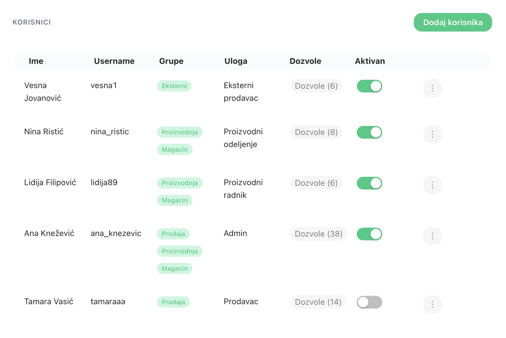
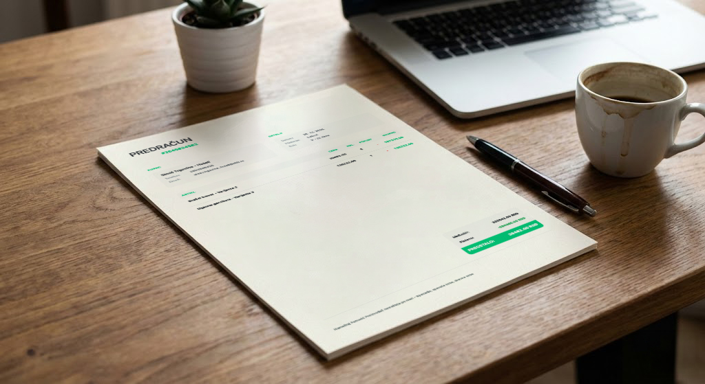
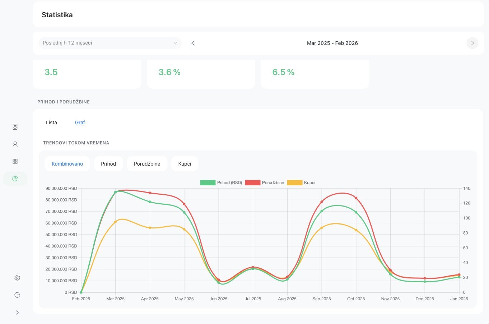

<!-- _class: cover -->
<!-- _paginate: false -->

Tvoj posao, pod kontrolom.

<h1>Tvoj posao — <em>red i mirna glava.</em></h1>

Sve na jednom mestu — kupci, narudžbine, fakture i pregled zarade.

<i class="bi bi-people-fill"></i> Kupci
<i class="bi bi-box-seam"></i> Porudžbine
<i class="bi bi-receipt"></i> Fakture
<i class="bi bi-graph-up-arrow"></i> Zarada

---

<!-- _paginate: false -->

Problem koji poznaješ

## Da vam posao ne oduzima *sav mir*

Posao je porastao — i to je dobra stvar. Ali kad ima više posla, teže je sve držati u glavi. Papiri znaju da naprave pometnju.

<i class="bi bi-journal-x"></i>

<h3>Rokovnik se izgubi baš kad treba</h3>

Sve si zapisao — ali gde? U kojoj svesci, na kom papiru, u kojoj fascikli?

"Znam da sam negde zapisao, ali..."

<i class="bi bi-file-earmark-x"></i>

<h3>Fakture i papiri gutaju vreme</h3>

Kraj meseca dođe brzo. A onda kreće sabiranje, traženje papira i pisanje faktura ručno.

"Ne znam ko mi duguje, a ko je platio."

<i class="bi bi-telephone-x"></i>

<h3>Radnik te zove, ti zoveš radnika</h3>

Ko je preuzeo porudžbinu, šta je gotovo, šta čeka — teško pratiti kad nema jednog mesta.

"Sto puta me pitaju istu stvar..."

<strong>Spona uvodi red u papire — i nije ništa komplikovanije od slanja poruka na Viberu.</strong>

---

Rešenje

## Digitalni rokovnik koji *sam računa*

Spona je rokovnik koji se ne može izgubiti — sam sabira i oduzima, pamti svakog kupca i svaki dogovor, i drži sve na jednom mestu od prvog dana.

<ul class="check-list">
<li>Svaki kupac i dogovor — zapisan i na mestu</li>
<li>Svaka porudžbina praćena od upisa do isporuke</li>
<li>Faktura gotova za pola minute, bez grešaka</li>
<li>Na kraju dana vidiš crno na belo kako stoji posao</li>
<li>Svaki radnik vidi samo šta njemu pripada</li>
<li>Radi na telefonu, tabletu i računaru</li>
</ul>

  
<i class="bi bi-display"></i>

  <strong>Glavni pregled</strong>
  Sve najvažnije na jednom ekranu — odmah vidiš kako stoji posao

---

<!-- _paginate: false -->

Spona u brojevima

## Provereno u praksi

30sek

<i class="bi bi-receipt"></i> Faktura od porudžbine do PDF-a

100%

<i class="bi bi-shield-fill-check"></i> Sigurni podaci

3 uloge

<i class="bi bi-people-fill"></i> Admin, Poslovođa, Radnik

0 inst.

<i class="bi bi-globe2"></i> Radi u svakom pretraživaču

---

<!-- _class: section-green -->
<!-- _paginate: false -->

01

## Tvoji kupci

Da uvek znaš šta si se s kim dogovorio — čak i za godinu dana.

---

## Nikad više izgubljen kontakt ni dogovor

<i class="bi bi-people"></i> 01 — Kupci

Upišeš kupca jednom — i sve što si s njim radio ostane u Sponi zauvek. Ime, telefon, istorija porudžbina, šta ste se dogovorili. Nema više: "Kako mu beše broj?"

<ul class="dot-list">
<li><strong>Ime, telefon, adresa</strong> — sve na jednom mestu</li>
<li><strong>Cela istorija porudžbina</strong> po svakom kupcu</li>
<li><strong>Nađeš bilo koga za sekundu</strong> — samo ukucaš ime</li>
<li><strong>Beleške uz profil</strong> — zapiši šta god treba upamtiti</li>
<li><strong>Grupe porudžbina</strong> — veleprodaja odvojeno od maloprodaje</li>
</ul>

 

Mirna glava

Čisti računi s kupcima — znaš ko ti šta duguje i šta ste se dogovorili, čak i kad si na odmoru.

<strong>Pregled kupaca</strong>
Jasna lista svih kupaca — nađeš koga treba za par sekundi

  
<i class="bi bi-person-fill"></i>

  <strong>Kartica kupca</strong>
  Sve porudžbine, dugovanja i beleške za jednog kupca

---

<!-- _class: section-green -->
<!-- _paginate: false -->

02

## Porudžbine

Da radnik ne mora da te zove deset puta dnevno da pita šta da radi.

---

## Svaka porudžbina — zapisana i praćena

<i class="bi bi-box-seam"></i> 02 — Porudžbine

Kupac naruči — ti upišeš u Sponu za minut. Od tog trenutka svaki radnik zna šta treba da uradi, bez telefoniranja i petljanja.

<ul class="dot-list">
<li><strong>Odabereš kupca</strong> iz svoje baze jednim klikom</li>
<li><strong>Dodaš šta je naručeno</strong> — cene se same upišu</li>
<li><strong>Gotovinsko, na fakturu, karticom</strong> — piše odmah</li>
<li><strong>Pratiš gde je porudžbina</strong> — u radu, gotovo, otkazano</li>
<li><strong>Ostavi napomenu radniku</strong> — bez telefoniranja</li>
</ul>

 

<h3 style="color:var(--brand-primary-dark);"><i class="bi bi-printer-fill"></i> Radni nalog na štampu</h3>
Jednim klikom odštampaš nalog za radionicu ili magacin — jasno napisano, bez grešaka. Radnik uzme papir i zna šta radi.

  
<i class="bi bi-box-seam"></i>

  <strong>Pregled porudžbina</strong>
  Vidiš sve porudžbine — šta čeka, šta je u radu, šta je gotovo

  
<i class="bi bi-pencil"></i>

  <strong>Unos nove porudžbine</strong>
  Brz unos — odabereš kupca, dodaš artikle, gotovo

---

<!-- _class: section-green -->
<!-- _paginate: false -->

03

## Fakture

Da završiš papire dok kupac još nije ni izašao iz radnje.

---

## Faktura za pola minute, bez greške

<i class="bi bi-receipt"></i> 03 — Fakture

Nema više ručnog pisanja. Spona napravi fakturu sama iz porudžbine — uredno, ispravno, s tvojim logom — za pola minute. Odštampaš ili pošalješ mejlom, gotovo.

<ul class="dot-list">
<li><strong>Sve se samo popuni</strong> iz porudžbine — nema ponovnog kucanja</li>
<li><strong>Odštampaj ili pošalji mejlom</strong> za dva klika</li>
<li><strong>Brojevi faktura idu sami po redu</strong> — ne moraš da pamtiš</li>
<li><strong>Jasno vidiš ko je platio, a ko nije</strong></li>
<li><strong>Tvoj logo i firma</strong> na svakoj fakturi</li>
</ul>

"Faktura je gotova pre nego što kupac izađe iz radnje."

<strong>Gotova faktura</strong>
Uredno odštampana faktura s tvojim logom — profesionalno, bez muke

  
<i class="bi bi-list-ul"></i>

  <strong>Pregled faktura</strong>
  Jasna lista — ko je platio, a ko nije

---

<!-- _class: section-green -->
<!-- _paginate: false -->

04

## Cenovnik i artikli

Cene se ne zaboravljaju — i uvek su ispravne.

---

## Cene se ne zaboravljaju — i uvek su ispravne

<i class="bi bi-tag"></i> 04 — Cenovnik

Upišeš sve što prodaješ jednom — i Spona ti to sama nudi svaki put kad praviš porudžbinu. Nema više računanja na papiru ili grešaka u ceni.

<ul class="dot-list">
<li><strong>Naziv i cena</strong> za svaki artikal ili uslugu</li>
<li><strong>Varijante</strong> — veličina, boja, tip — sve jasno razdvojeno</li>
<li><strong>Kategorije</strong> za lakše snalaženje u velikim cenovnicima</li>
<li><strong>Posebne cene po kupcu</strong> — veleprodaja, stalni kupci</li>
</ul>

 

Kako to izgleda u praksi

Pri unosu porudžbine samo ukucaš par slova — Spona iskoči s artiklom i cenom. Odabereš količinu, gotovo. Nema greške, nema računanja.

  
<i class="bi bi-grid"></i>

  <strong>Cenovnik</strong>
  Svi tvoji artikli i cene na jednom mestu

  
<i class="bi bi-tag-fill"></i>

  <strong>Kartica artikla</strong>
  Varijante, cene i opis — sve na jednom mestu

---

<!-- _class: section-green -->
<!-- _paginate: false -->

05

## Zarada

Bez sabiranja do ponoći — crno na belo vidiš kako stoji posao.

---

## Crno na belo — bez digitrona

<i class="bi bi-graph-up-arrow"></i> 05 — Zarada

Nema više sabiranja do ponoći. Otvoriš Sponu — i odmah vidiš čiste račune: ko je platio, koliko si zaradio, šta se dobro prodaje.

<i class="bi bi-graph-up-arrow"></i>

Koliko si zaradio

<i class="bi bi-star-fill"></i>

Ko ti nosi najviše

<i class="bi bi-box-seam"></i>

Šta ide, šta stoji

<ul class="dot-list">
<li><strong>Zarada po danu, mesecu ili godini</strong> — bez jednog sabiranja</li>
<li><strong>Ko ti donosi najviše para</strong> — da znaš na koga da računaš</li>
<li><strong>Šta se dobro prodaje, a šta skuplja prašinu</strong></li>
<li><strong>Ko od radnika šta uradi</strong> — bez ispitivanja</li>
</ul>

<strong>Pregled poslovanja</strong>
Odmah vidiš gde si u plusu i šta se dobro prodaje

---

<!-- _class: section-green -->
<!-- _paginate: false -->

06

## Tim

Ne moraš sve da pratiš lično — Spona sredi ko šta radi.

---

## Svako zna svoj deo posla

<i class="bi bi-people"></i> 06 — Tim

Svaki radnik se prijavi sa svojim nalogom i odmah vidi šta ga čeka — ni više ni manje. A ti kao gazda uvek možeš da proveriš šta se radi, gde god da si.

Ko šta vidi

<ul class="dot-list">
<li><strong>Ti kao gazda</strong> — vidiš i menjaš baš sve</li>
<li><strong>Poslovođa</strong> — prati tim i sve porudžbine</li>
<li><strong>Radnik / prodavac</strong> — unosi porudžbine, vidi samo što mu treba</li>
</ul>

Čisti računi unutar firme

Svako ima svoju lozinku. Cene, kupci, zarada — to ostaje između tebe i Spone. Niko sa strane ne može da zaviri.

  
<i class="bi bi-people-fill"></i>

  <strong>Pregled radnika</strong>
  Ko je u timu i šta svako sme da radi

  
<i class="bi bi-gear-fill"></i>

  <strong>Nalog radnika</strong>
  Svaki radnik ima svoje pristupne podatke

---

<!-- _class: section-dark -->
<!-- _paginate: false -->

Jednostavno kao daljinski od TV-a

## Radi na telefonu, tabletu i računaru

Nema komplikovane obuke — ako umeš da koristiš telefon, umeš da koristiš Sponu.

---

<!-- _class: section-dark -->
<!-- _paginate: false -->

## Radi na telefonu, tabletu i računaru

<i class="bi bi-display"></i>

<h3>U kancelariji</h3>

Na računaru imaš pun pregled — idealno za unos i praćenje svega.

<i class="bi bi-phone-fill"></i>

<h3>Na terenu</h3>

Na telefonu proveriš porudžbinu ili status dok si kod kupca ili na isporuci.

<i class="bi bi-airplane-fill"></i>

<h3>Na odmoru</h3>

Otvoriš Sponu na telefonu i za minut znaš šta se dešava u firmi — pa se opusti.

Nema instalacije, nema komplikacija

<strong>Spona radi u pretraživaču — otvoriš kao stranicu, kao Facebook ili YouTube. Ništa posebno ne treba instalirati.</strong>

---

<!-- _class: section-dark -->
<!-- _paginate: false -->

Kako početi?

## Kreneš za tri koraka — mi smo uz tebe

Mi smo tu uz tebe — od prvog dana.

---

## Kreneš za tri koraka — mi smo uz tebe

1

<h3>Javi nam se</h3>

Pozoveš ili nam pišeš — za koji minut dobiješ pristup. Nema papirologije.

<i class="bi bi-clock"></i> Odmah

2

<h3>Unesimo podatke zajedno</h3>

Mi ti pomognemo da uneseš kupce, artikle i cenovnik. Ne moraš ništa sam.

<i class="bi bi-clock"></i> ~30 minuta

3

<h3>Spreman odmah</h3>

Napraviš prvu porudžbinu i odmah osetiš razliku. A mi smo tu kad zatreba.

<i class="bi bi-check-circle-fill"></i> Spreman!

Nisi sam

<strong>Obučavamo tebe i tvoje radnike, odgovaramo na sva pitanja i dostupni smo kad zatreba. Nisi prepušten sam sebi.</strong>

---

<!-- _class: section-green -->
<!-- _paginate: false -->

07

## Jasne cene, bez iznenađenja

Odaberi plan koji odgovara tvojoj firmi. Besplatan period od 14 dana — bez kreditne kartice.

---

## Jasne cene, bez iznenađenja

Odaberi plan koji odgovara tvojoj firmi. Besplatan period od 14 dana — bez kreditne kartice.

Starter

2.900 RSD

mesečno

Savršen za frilensere i male timove koji tek počinju.

<ul class="price-list">
<li>Do 3 korisnika</li>
<li>Kupci i porudžbine</li>
<li>Predračuni (PDF)</li>
<li>Email podrška</li>
</ul>

★ Najpopularniji

Standard

5.900 RSD

mesečno

Za rastuće firme kojima treba više kontrole i saradnje.

<ul class="price-list">
<li>Sve iz Starter plana</li>
<li>Do 10 korisnika</li>
<li>Korisničke uloge</li>
<li>Statistika</li>
<li>Prioritetna podrška</li>
</ul>

Pro

Dogovor

mesečno

Za etablirane firme sa velikim timovima i punim zahtevima.

<ul class="price-list">
<li>Sve iz Standard plana</li>
<li>Neograničeni korisnici</li>
<li>Napredne funkcionalnosti</li>
<li>Personalizovane funkcionalnosti</li>
</ul>

Nisi siguran koji plan? Javi nam se i pomoći ćemo ti da odabereš pravi.

---

<!-- _paginate: false -->

Česta pitanja

## Imaš pitanja? Mi imamo odgovore.

<i class="bi bi-plus-circle"></i> Da li postoji besplatni probni period?

Da! Svaki plan dolazi sa 14 dana besplatnog korišćenja — bez kreditne kartice. Možeš testirati sve funkcije pre nego što se odlučiš.

<i class="bi bi-plus-circle"></i> Da li moram da instaliram nešto?

Ne. Spona je cloud aplikacija koju koristiš direktno iz browsera. Nema instalacije, nema ažuriranja — uvek si na najnovijoj verziji.

<i class="bi bi-plus-circle"></i> Koji korisnički uloge postoje?

Postoje tri uloge: <strong>Admin</strong> koji ima pun pristup svim funkcijama, <strong>Poslovođa</strong> koji prati tim i porudžbine, i <strong>Radnik</strong> koji vidi samo ono što mu treba.

<i class="bi bi-plus-circle"></i> Da li su moji podaci bezbedni?

Apsolutno. Svi podaci su šifrovani SSL/TLS protokolom, a serveri se nalaze u EU datacentrima koji zadovoljavaju GDPR standarde.

<i class="bi bi-plus-circle"></i> Mogu li da otkažem pretplatu u bilo kom trenutku?

Da, bez ikakvih penala. Možeš otkazati pretplatu direktno iz podešavanja naloga. Pristup ostaje aktivan do kraja plaćenog perioda.

---

<!-- _class: cover -->
<!-- _paginate: false -->

  Spona

<h1 style="font-family:'Bricolage Grotesque','Inter',sans-serif;font-size:3.2rem;font-weight:800;line-height:1.1;margin:0;color:#ffffff;letter-spacing:-0.02em;">Tvoj posao, pod kontrolom.</h1>

Kupci. Porudžbine. Fakture. Zarada. Sve na jednom mestu — i mirna glava na kraju dana.

<a style="display:inline-flex;align-items:center;gap:8px;background:var(--brand-primary);color:#0a2a1c;border-radius:100px;padding:12px 28px;font-size:0.88rem;font-weight:700;text-decoration:none;"><i class="bi bi-envelope-fill"></i> Pošalji upit</a>
<a style="display:inline-flex;align-items:center;gap:8px;background:rgba(255,255,255,0.08);color:#ffffff;border:1px solid rgba(255,255,255,0.2);border-radius:100px;padding:12px 28px;font-size:0.88rem;font-weight:700;text-decoration:none;"><i class="bi bi-telephone-fill"></i> Pozovi nas</a>

